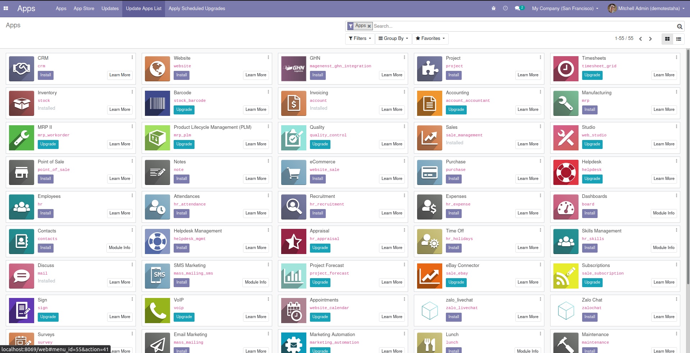
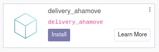
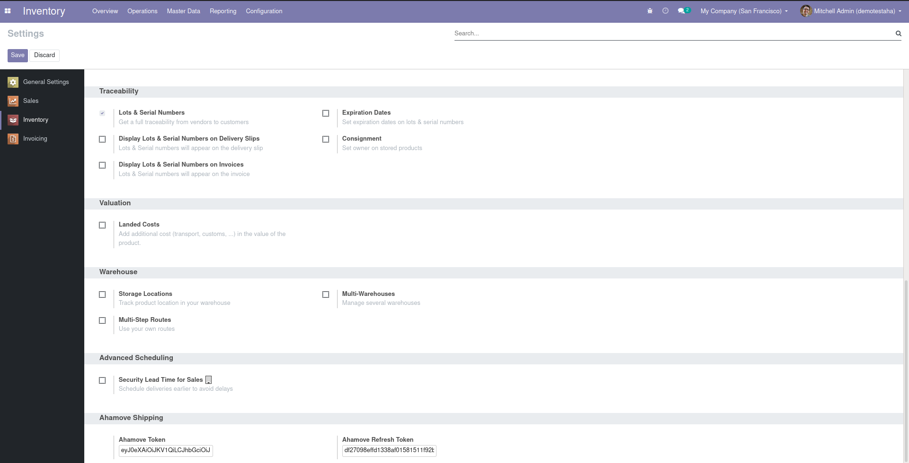
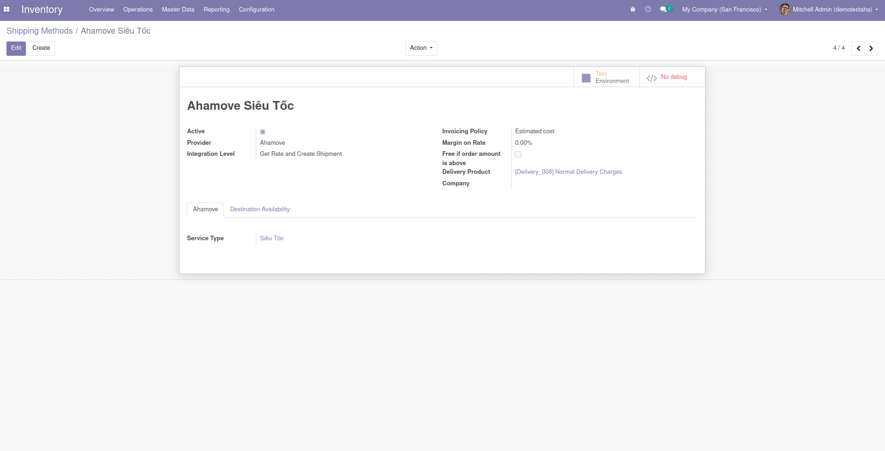

# Ahamove Integration for Odoo

## Installation

Pull the code to your custom-addons folder

```shell
git clone --branch <version> https://github.com/linhhonblade/delivery_ahamove 
<your_addons_folder>
```

On your Odoo instance, go to `Apps` and `Update the App List`



Search for module `delivery_ahamove` and install it



Follow the guide from [Ahamove Partner Integration](https://developers.ahamove.com/#overview) to 
get your token. The ahamove token will be saved in Inventory > Settings



Reminds that if your token is for production api, you have to switch the delivery method to 
production too (edit in delivery method form)



## TODO

### Functionality

- [x] Production and Staging url
  
Handle Exception:

- [ ] Exceptions which raise UserWarning
- [ ] Exceptions which raise UserError

Future Features:

- [ ] Add user guide to form view of shipping method (like UPS and other method)
- [ ] Add a step to retrieve token from API key and phone and save the API key

### Testing

- [ ] Create order and get rate shipment
- [ ] Confirm order and validate the delivery
- [ ] Get tracking url
- [ ] Cancel shipment

#### Case 1: Simulate the whole process from creating sale order to cancel shipment
- Create a sale order:
    - product: storable type with some qty on hand
    - customer: in Vietnam
    - company address: in Vietnam
- Get rate shipment and add to the sale order
- Confirm sale order
    - Check the picking
- Set qty done on stock moves
- Validate the picking
    - Check if the tracking number is generated
    - Check the tracking url is generated
- Cancel the shipping
    - Check the tracking number and tracking url is set to False

#### Case 2: Simulate the process in case user choose wrong service type
#### Case 3: Simulate the process in case the address not found

### Prepare demo data

- [ ] Company and Customer in Vietnam
- [ ] currency VND
- [ ] A sample service type